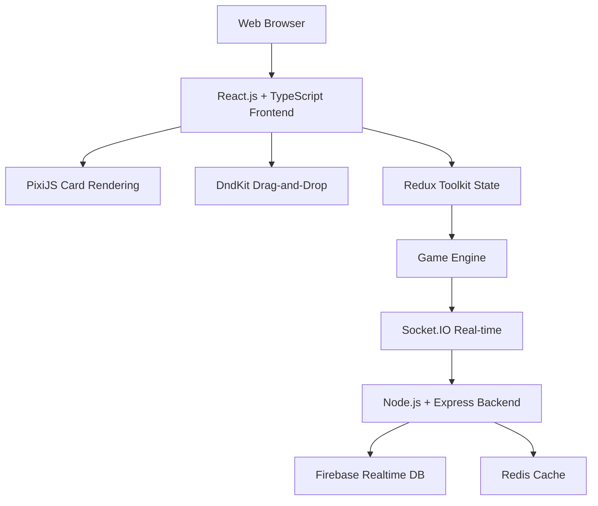
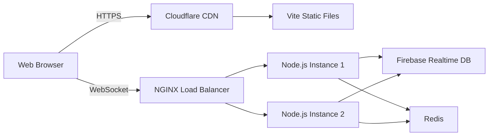

# Final Board Game Prototype Architecture Plan
## Incorporating Tech Stack Recommendations

## Updated System Architecture



## Enhanced Core Components

### 1. Advanced Card System
- **PixiJS Integration**: High-performance card rendering with animations
- **DndKit Implementation**: Smooth drag-and-drop card interactions
- **TypeScript Classes**: Strongly-typed card mechanics

### 2. Real-time Multiplayer System
- **Socket.IO Integration**: WebSocket-based real-time synchronization
- **Game State Diffing**: Minimal WebSocket message payloads
- **Client-side Prediction**: Smooth multiplayer experience

### 3. Enhanced Game Engine
```typescript
class GameEngine {
  private state: GameState;
  private socketServer: SocketIO.Server;
  private cardEffectProcessor: CardEffectProcessor;
  private workerPlacementSystem: WorkerPlacementSystem;

  constructor() {
    this.state = new GameState();
    this.socketServer = new SocketIO.Server();
    this.cardEffectProcessor = new CardEffectProcessor();
    this.workerPlacementSystem = new WorkerPlacementSystem();
  }

  public async processTurn(playerId: string, action: GameAction): Promise<GameState> {
    // Validate action
    const validation = this.validateAction(playerId, action);
    if (!validation.valid) throw new Error(validation.message);

    // Process action
    const newState = this.applyActionToState(this.state, action);

    // Broadcast to all players
    await this.socketServer.broadcastGameState(newState);

    return newState;
  }
}
```

## Updated Implementation Plan

### Phase 1: Core Infrastructure (Week 1)
1. **Project Setup**
   - Vite + React + TypeScript project initialization
   - Node.js + Express backend setup
   - Socket.IO integration for real-time

2. **Core Systems**
   - Redux Toolkit store configuration
   - Firebase Realtime Database integration
   - Basic game state management

### Phase 2: Game Mechanics (Week 2)
1. **Card System**
   - PixiJS card rendering engine
   - DndKit drag-and-drop implementation
   - Card effect processor with TypeScript

2. **Map System**
   - Interactive 20-spot grid with PixiJS
   - Worker placement logic
   - Adjacency calculation system

### Phase 3: Multiplayer & Polish (Week 3)
1. **Real-time Features**
   - Socket.IO synchronization
   - Game lobby and matchmaking
   - Client-side prediction

2. **Performance Optimization**
   - React.memo for component optimization
   - Web Workers for heavy calculations
   - MessagePack for binary protocols

## Technical Stack Integration

### Frontend Enhancements
```typescript
// Card Component with PixiJS
const CardComponent: React.FC<{card: Card}> = ({ card }) => {
  const pixiApp = useRef<PIXI.Application>();
  const [position, setPosition] = useState({x: 0, y: 0});

  useEffect(() => {
    // Initialize PixiJS card rendering
    pixiApp.current = new PIXI.Application({
      width: 200,
      height: 300,
      backgroundColor: getColorForGuild(card.guild)
    });

    // Add card graphics and animations
    const cardSprite = createCardSprite(card);
    pixiApp.current.stage.addChild(cardSprite);

    return () => pixiApp.current?.destroy();
  }, [card]);

  return (
    <div className="card-container" style={{transform: `translate(${position.x}px, ${position.y}px)`}}>
      <div ref={containerRef} className="pixi-container" />
    </div>
  );
};
```

### Backend Architecture
```typescript
// Express + Socket.IO Server
const app = express();
const server = createServer(app);
const io = new Server(server, {
  cors: {
    origin: process.env.FRONTEND_URL,
    methods: ["GET", "POST"]
  }
});

// Game state management
const gameStates = new Map<string, GameState>();
const connectedPlayers = new Map<string, Socket>();

io.on('connection', (socket) => {
  console.log('Player connected:', socket.id);

  socket.on('joinGame', (gameId: string, playerId: string) => {
    // Join game room
    socket.join(gameId);
    connectedPlayers.set(playerId, socket);

    // Send current game state
    const gameState = gameStates.get(gameId);
    socket.emit('gameState', gameState);
  });

  socket.on('gameAction', (gameId: string, action: GameAction) => {
    // Process action and broadcast
    const newState = gameEngine.processAction(gameId, action);
    io.to(gameId).emit('gameStateUpdate', newState);
  });
});
```

## Database Structure

### Firebase Realtime Database Schema
```json
{
  "games": {
    "game1": {
      "id": "game1",
      "players": {
        "player1": {
          "id": "player1",
          "name": "Alice",
          "hand": ["card1", "card2", "card3"],
          "deck": ["card4", "card5"],
          "resources": { "gold": 5, "knowledge": 2 },
          "score": 10
        }
      },
      "currentTurn": "player1",
      "phase": "action",
      "map": {
        "spots": {
          "1": { "player": "player1", "armies": 2, "outpost": false },
          "2": { "player": null, "armies": 0, "outpost": true }
        }
      }
    }
  }
}
```

## Performance Optimization Strategies

### Frontend Optimization
1. **Component Virtualization**: Virtualized card lists
2. **Memoization**: React.memo for card components
3. **Web Workers**: Offload card effect calculations
4. **PixiJS Optimization**: Sprite batching and texture atlases

### Backend Optimization
1. **State Diffing**: Only send changed game state
2. **Connection Pooling**: Database connection management
3. **Rate Limiting**: Prevent abuse of game actions
4. **Redis Caching**: Cache frequent game state queries

## Updated Testing Strategy

### Test Coverage
1. **Unit Tests**: Jest for individual components
2. **Integration Tests**: Cypress for full game flow
3. **Performance Tests**: Lighthouse audits
4. **Multiplayer Tests**: Socket.IO stress testing

### Test Examples
```typescript
// Card effect test
describe('CardEffectProcessor', () => {
  it('should process military card correctly', () => {
    const processor = new CardEffectProcessor();
    const result = processor.process({
      guild: 'military',
      position: 1,
      player: testPlayer
    });

    expect(result.armiesAdded).toBe(1);
    expect(result.goldSpent).toBe(1);
  });
});

// Socket.IO test
describe('Real-time synchronization', () => {
  it('should broadcast game state updates', (done) => {
    const client1 = io.connect();
    const client2 = io.connect();

    client1.emit('gameAction', 'game1', { type: 'playCard', cardId: 'card1' });

    client2.on('gameStateUpdate', (state) => {
      expect(state.players[0].hand).not.toContain('card1');
      done();
    });
  });
});
```

## Deployment Architecture



## Implementation Roadmap

### Week 1: Foundation
- [ ] Set up Vite + React + TypeScript project
- [ ] Configure Node.js + Express + Socket.IO backend
- [ ] Implement Firebase Realtime Database integration
- [ ] Create basic game state management with Redux

### Week 2: Core Mechanics
- [ ] Implement PixiJS card rendering system
- [ ] Build DndKit drag-and-drop card interactions
- [ ] Create card effect processor with TypeScript
- [ ] Develop worker placement and map system

### Week 3: Multiplayer & Polish
- [ ] Implement Socket.IO real-time synchronization
- [ ] Add game lobby and matchmaking system
- [ ] Optimize performance with Web Workers
- [ ] Add comprehensive testing suite

## Next Steps

This updated architecture plan incorporates the advanced recommendations from tech_stack.md while maintaining the original game requirements. The plan now includes:

1. **PixiJS** for high-performance card rendering
2. **Socket.IO** for real-time multiplayer synchronization
3. **Firebase Realtime Database** for game state persistence
4. **Advanced optimization** techniques for both frontend and backend
5. **Comprehensive testing** strategy

Would you like me to proceed with implementing this enhanced architecture plan?