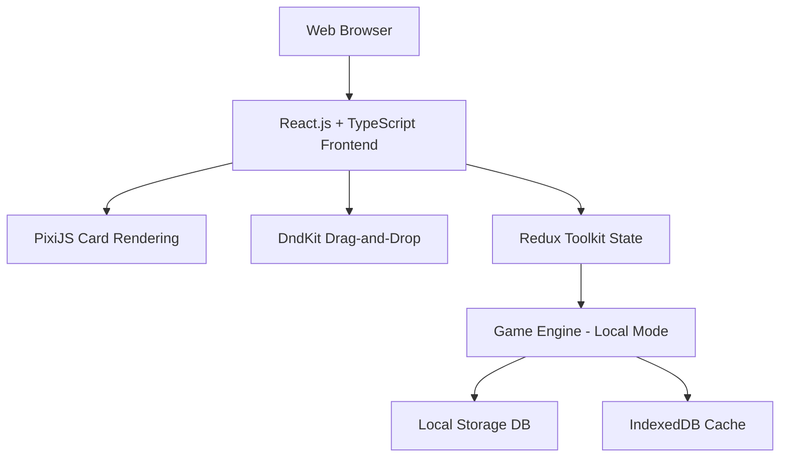
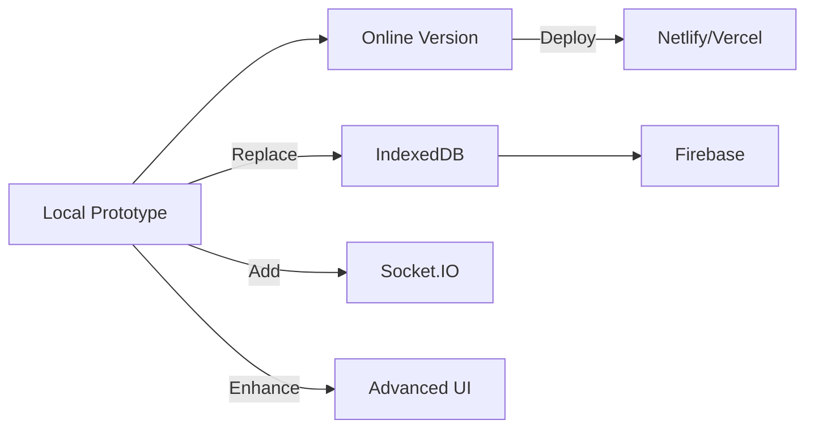

# Local Board Game Prototype Plan
## Optimized for Rapid Development and Testing

## Updated Architecture for Local Development



## Local Database Strategy

### Primary Local Storage
- **IndexedDB**: For game state persistence between sessions
- **LocalStorage**: For simple settings and preferences
- **JSON Files**: For initial card deck and map configuration

### Database Structure
```typescript
// Local Game State Interface
interface LocalGameState {
  id: string;
  players: LocalPlayer[];
  currentTurn: number;
  phase: 'setup' | 'playing' | 'ended';
  map: MapSpot[];
  commonDeck: Card[];
  createdAt: string;
  updatedAt: string;
}

// IndexedDB Schema
const DB_SCHEMA = {
  name: 'BoardGameDB',
  version: 1,
  stores: {
    games: '++id, *gameData',
    players: '++id, *playerData',
    settings: 'key'
  }
};
```

## Simplified Implementation Plan

### Phase 1: Core Setup (Day 1-2)
1. **Project Initialization**
   - Vite + React + TypeScript setup
   - Basic folder structure
   - Local storage utilities

2. **Card System**
   - JSON-based card deck (50 cards)
   - Basic card rendering with PixiJS
   - Simple drag-and-drop with DndKit

### Phase 2: Game Mechanics (Day 3-4)
1. **Map System**
   - 20-spot grid implementation
   - Local adjacency logic
   - Army placement system

2. **Game Engine**
   - Turn management (Expand/Consolidate)
   - Resource tracking
   - Basic AI opponent

### Phase 3: Polish & Testing (Day 5)
1. **UI Enhancements**
   - Player dashboard
   - Game status display
   - Action buttons

2. **Local Testing**
   - Single-player testing
   - Hot-seat multiplayer
   - Performance optimization

## Local Development Stack

### Frontend Components
```typescript
// Local Game Engine
class LocalGameEngine {
  private state: LocalGameState;
  private storage: LocalStorageManager;

  constructor() {
    this.storage = new LocalStorageManager();
    this.state = this.storage.loadGame() || this.createNewGame();
  }

  public saveGame(): void {
    this.storage.saveGame(this.state);
  }

  public processAction(action: GameAction): LocalGameState {
    const newState = this.applyAction(this.state, action);
    this.state = newState;
    this.saveGame();
    return newState;
  }

  private createNewGame(): LocalGameState {
    return {
      id: generateUUID(),
      players: [createPlayer('Player 1'), createPlayer('Player 2')],
      currentTurn: 0,
      phase: 'setup',
      map: createInitialMap(),
      commonDeck: createShuffledDeck(),
      createdAt: new Date().toISOString(),
      updatedAt: new Date().toISOString()
    };
  }
}
```

### Local Storage Implementation
```typescript
class LocalStorageManager {
  private db: IDBDatabase | null = null;

  constructor() {
    this.initDB();
  }

  private async initDB(): Promise<void> {
    const request = indexedDB.open('BoardGameDB', 1);

    request.onupgradeneeded = (event) => {
      const db = (event.target as IDBOpenDBRequest).result;
      if (!db.objectStoreNames.contains('games')) {
        db.createObjectStore('games', { keyPath: 'id' });
      }
    };

    request.onsuccess = () => {
      this.db = request.result;
    };
  }

  public async saveGame(game: LocalGameState): Promise<void> {
    if (!this.db) await this.initDB();

    return new Promise((resolve, reject) => {
      const transaction = this.db!.transaction('games', 'readwrite');
      const store = transaction.objectStore('games');
      const request = store.put(game);

      request.onsuccess = () => resolve();
      request.onerror = () => reject(request.error);
    });
  }

  public async loadGame(): Promise<LocalGameState | null> {
    if (!this.db) await this.initDB();

    return new Promise((resolve) => {
      const transaction = this.db!.transaction('games', 'readonly');
      const store = transaction.objectStore('games');
      const request = store.getAll();

      request.onsuccess = () => {
        const games = request.result;
        resolve(games.length > 0 ? games[0] : null);
      };
    });
  }
}
```

## Rapid Development Strategy

### Quick Start Approach
1. **JSON-based Configuration**
   - Card deck in JSON file
   - Map layout in JSON file
   - Game rules in configuration

2. **Minimal Backend**
   - No server required for prototype
   - All logic in frontend
   - Local storage for persistence

3. **Progressive Enhancement**
   - Start with basic UI
   - Add animations later
   - Implement multiplayer after core mechanics

## Testing Plan for Local Prototype

### Test Scenarios
1. **Single Player Testing**
   - Verify card playing mechanics
   - Test turn sequence
   - Validate resource management

2. **Hot-seat Multiplayer**
   - Test player switching
   - Verify game state persistence
   - Check win conditions

3. **Performance Testing**
   - Memory usage monitoring
   - Rendering performance
   - Action processing speed

### Test Data
```json
// Sample card deck (cards.json)
{
  "guilds": [
    {
      "name": "military",
      "cards": [
        {
          "id": "military-blue-1",
          "color": "blue",
          "position": 1,
          "power": "Army. Pay 1 Gold → Army",
          "bonus": "Gain 1 Gold"
        },
        {
          "id": "military-red-1",
          "color": "red",
          "position": 1,
          "power": "Army. Pay 1 Gold → Army",
          "bonus": "Gain 1 Army"
        }
      ]
    }
  ]
}
```

## Migration Path to Online

### Future Enhancement Plan
1. **Add Socket.IO** for real-time multiplayer
2. **Integrate Firebase** for online persistence
3. **Implement matchmaking** system
4. **Add user accounts** and authentication

### Migration Strategy


## Implementation Roadmap

### Day-by-Day Plan
```markdown
**Day 1**: Project setup and card system
- [ ] Initialize Vite + React + TypeScript
- [ ] Create card JSON data structure
- [ ] Implement basic card rendering

**Day 2**: Map and game engine
- [ ] Build 20-spot grid map
- [ ] Implement adjacency logic
- [ ] Create turn management system

**Day 3**: Core mechanics
- [ ] Expand/Consolidate actions
- [ ] Resource tracking
- [ ] Basic AI opponent

**Day 4**: UI and testing
- [ ] Player dashboard
- [ ] Game status display
- [ ] Local testing

**Day 5**: Polish and finalize
- [ ] Performance optimization
- [ ] Bug fixing
- [ ] Prototype completion
```

## Next Steps

This local prototype plan provides:
- ✅ **Rapid development** with local storage
- ✅ **All original requirements** maintained
- ✅ **Clear migration path** to online version
- ✅ **Focused testing** strategy
- ✅ **Progressive enhancement** approach

Would you like me to proceed with implementing this local prototype plan? I can switch to Code mode to start building immediately.