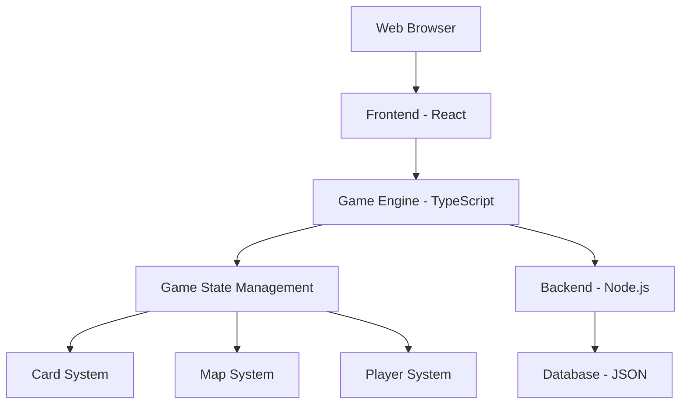

# Board Game Prototype Architecture Plan

## Overview
This document outlines the architecture for building a digital web-based prototype of the board game with 50 cards (5 guilds × 10 cards, 2 colors per guild) and a 20-spot grid map.

## System Architecture



## Core Components

### 1. Card System
- **5 Guilds**: Military, Culture, Technology, Royal, Building
- **5 Colors**: Blue, Red, Green, Yellow, Purple
- **Deck Structure**: 50 cards total (10 per guild, 2 colors per guild)
- **Power Scaling**: Based on position in guild pile (1st, 2nd/3rd, 4th/5th cards)

### 2. Map System
- **Grid Layout**: 20 spots (5×4 grid)
- **Army Placement**: Adjacent placement rules
- **Outpost System**: Special spots for civilization upgrades

### 3. Game Mechanics
- **Turn Structure**: Expand or Consolidate actions
- **Resource System**: Gold, Knowledge, Victory Points
- **Free Actions**: Army, Fight, Take actions

## Implementation Plan

### Phase 1: Core Structure
1. **Card Deck Creation**
   - Define card data structure with guild, color, and power attributes
   - Implement power scaling logic
   - Create 50 unique card configurations

2. **Map System**
   - Design 5×4 grid layout
   - Implement army placement logic
   - Create outpost system

3. **Game Engine**
   - Turn management system
   - Action resolution (Expand/Consolidate)
   - Resource tracking

### Phase 2: UI Implementation
1. **React Frontend**
   - Card display and interaction
   - Map visualization
   - Player dashboard

2. **Game State Management**
   - Player hands and decks
   - Guild piles tracking
   - Score tracking

### Phase 3: Testing
1. **Unit Testing**
   - Card mechanics
   - Map logic
   - Turn management

2. **Integration Testing**
   - Full game flow
   - Multiplayer interactions
   - UI responsiveness

## Technical Stack
- **Frontend**: React with TypeScript
- **Backend**: Node.js (if needed for persistence)
- **State Management**: Redux or Context API
- **Styling**: CSS Modules or Tailwind
- **Build Tool**: Vite or Create React App

## Data Structures

### Card Interface
```typescript
interface Card {
  id: string;
  guild: 'military' | 'culture' | 'technology' | 'royal' | 'building';
  color: 'blue' | 'red' | 'green' | 'yellow' | 'purple';
  position: number; // 1-5 in guild pile
  power: string; // Scaled based on position
  bonus: string; // Bonus effect
}
```

### Game State Interface
```typescript
interface GameState {
  players: Player[];
  currentPlayer: number;
  commonDeck: Card[];
  map: MapSpot[];
  wonders: Wonder[];
  gamePhase: 'setup' | 'playing' | 'ended';
}
```

## Development Timeline

1. **Week 1**: Core game logic and card system
2. **Week 2**: Map system and basic UI
3. **Week 3**: Complete UI and testing
4. **Week 4**: Bug fixing and prototype refinement

## Testing Strategy
- **Manual Testing**: Playthrough sessions
- **Automated Testing**: Jest for unit tests
- **User Testing**: Feedback collection

## Next Steps
1. Create card data structure
2. Implement map layout
3. Build core game engine
4. Develop basic UI components