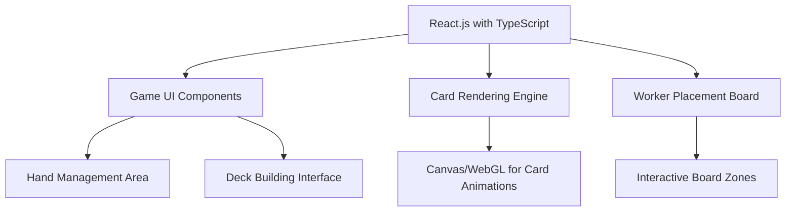
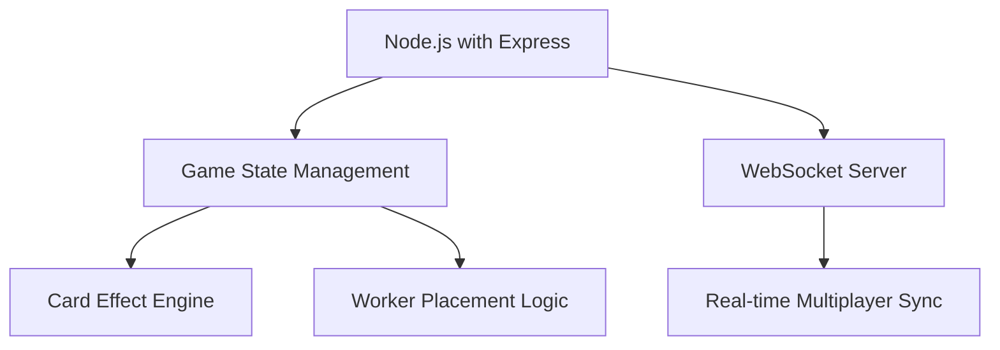
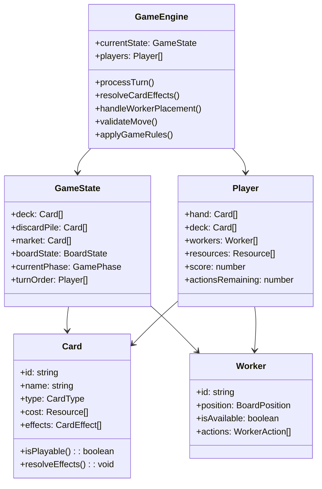
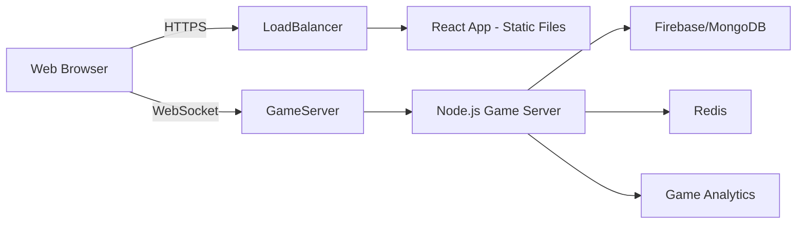

# Board Game Digital Version - Tech Stack Recommendation

## Overview

This document provides a comprehensive technology stack recommendation for creating a digital version of your board game, which combines deck building, hand management, and worker placement mechanics. The recommendation is based on analysis of Dominion's digital version and optimized for modern web development best practices.

## Game Requirements Analysis

Your game requires three core mechanics:
- **Deck Building**: Complex card interactions and state management
- **Hand Management**: Real-time card manipulation and visualization
- **Worker Placement**: Board state management with placement logic
- **Multiplayer**: Real-time synchronization between players

## Recommended Tech Stack

### 1. Frontend Technology

**Primary Framework**: React.js with TypeScript



**Key Libraries**:
- **PixiJS** or **Three.js**: For high-performance card rendering and animations
- **DndKit** or **React Beautiful DND**: For drag-and-drop card/worker interactions
- **React Router**: For navigation between game screens
- **Redux Toolkit** or **Zustand**: For complex game state management

**Why React.js with TypeScript?**
- Excellent for complex UI state management (cards, hands, boards)
- TypeScript provides type safety for game logic and prevents runtime errors
- Rich ecosystem for animations and drag-and-drop interactions
- Component-based architecture naturally matches game zones (hand, deck, board, market)

### 2. Backend Technology

**Primary Framework**: Node.js with Express



**Key Libraries**:
- **Socket.IO**: For real-time WebSocket communication
- **Express.js**: For REST API endpoints and game session management
- **Joi** or **Zod**: For request validation
- **Winston** or **Pino**: For logging game events

**Why Node.js?**
- Event-driven architecture perfect for turn-based games
- WebSocket support for real-time multiplayer synchronization
- JavaScript consistency across full stack reduces context switching
- Excellent for handling game state persistence and complex game logic

### 3. Game Engine Architecture



### 4. Database & Storage

**Primary Database**: Firebase Realtime Database or MongoDB

**Caching Layer**: Redis

**Key Considerations**:
- **Firebase Realtime Database**: Excellent for real-time synchronization, automatic scaling
- **MongoDB**: More flexible schema for complex game states, better querying
- **Redis**: For caching frequently accessed game states and session data

**Data Structure Examples**:

```typescript
// Game State Document
interface GameState {
  _id: string;
  gameId: string;
  players: Player[];
  currentTurn: number;
  phase: 'setup' | 'action' | 'buy' | 'cleanup';
  deck: Card[];
  market: Card[];
  board: BoardState;
  createdAt: Date;
  updatedAt: Date;
}

// Player Document
interface Player {
  userId: string;
  gameId: string;
  hand: Card[];
  deck: Card[];
  discard: Card[];
  workers: Worker[];
  resources: {
    coins: number;
    actions: number;
    buys: number;
  };
  score: number;
}
```

### 5. Deployment Architecture



**Deployment Components**:
- **Frontend**: Static files served via CDN (Cloudflare, AWS CloudFront)
- **Backend**: Node.js servers with auto-scaling (AWS EC2, Google Cloud Run)
- **Database**: Managed database service (Firebase, MongoDB Atlas)
- **WebSockets**: Dedicated WebSocket servers for real-time communication
- **Monitoring**: Prometheus + Grafana for performance monitoring

## Comparison with Dominion's Digital Version

| Aspect | Dominion's Approach | Our Recommendation | Benefits |
|--------|---------------------|--------------------|----------|
| **Frontend** | Custom HTML5/Canvas | React.js + TypeScript | Better component isolation, type safety |
| **State Management** | Custom framework | Redux/Zustand | More predictable state management |
| **Real-time** | Basic WebSockets | Socket.IO | More robust connection handling |
| **Animations** | Canvas-based | PixiJS/Three.js | Better performance, more effects |
| **Type Safety** | JavaScript | TypeScript | Fewer runtime errors, better IDE support |
| **Testing** | Limited | Jest + Testing Library | Comprehensive test coverage |

## Implementation Roadmap

### Phase 1: Core Infrastructure
1. Set up React.js + TypeScript project with Vite
2. Configure Node.js backend with Express and Socket.IO
3. Implement basic game state management
4. Set up database connections

### Phase 2: Game Mechanics
1. Implement card system with TypeScript classes
2. Build worker placement logic
3. Create hand management UI components
4. Develop market/deck interaction system

### Phase 3: Multiplayer & Polish
1. Implement real-time synchronization
2. Add game lobby and matchmaking
3. Optimize animations and UI/UX
4. Add comprehensive testing

## Development Tools Recommendation

- **Version Control**: Git with GitHub/GitLab
- **CI/CD**: GitHub Actions or GitLab CI
- **Testing**: Jest, React Testing Library, Cypress
- **Code Quality**: ESLint, Prettier, TypeScript strict mode
- **Project Management**: Jira or GitHub Projects

## Performance Considerations

1. **Frontend Optimization**:
   - Use React.memo for component optimization
   - Implement virtualization for large card collections
   - Use Web Workers for heavy card effect calculations

2. **Backend Optimization**:
   - Implement game state diffing for minimal WebSocket messages
   - Use connection pooling for database access
   - Implement rate limiting for API endpoints

3. **Network Optimization**:
   - Compress WebSocket messages
   - Implement client-side prediction for smoother gameplay
   - Use binary protocols (MessagePack) for complex game states

This comprehensive tech stack provides a modern, scalable foundation for your digital board game that addresses all three core mechanics while providing excellent performance and maintainability.